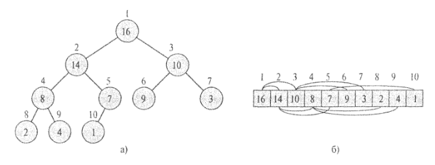

# Interview questions

# Code samples

```
#include <stdio.h>
#include <stdlib.h>
#include <time.h>


char* intToStr(int x)
{
    char buf[4];
    sprintf(buf, "%d", x);
    return buf;
}

int main(int argc, char *argv[])
{
    srand(time(NULL));

    int a = rand() % 10500; // 3456

    printf("Hello world!\n");

    char *str = intToStr(a);
    printf("Integer is %s\n", str);

    return str != NULL ? 0 : 1;
}
```
```
#include <thread>
#include <mutex>
#include <iostream>

static volatile int counter = 0;
static std::mutex m;

static void safe_inc(int inc)
{
    for (int i = 0; i<1e7; ++i) {
        std::unique_lock<std::mutex>(m);
        counter += inc;
    }
}

int main()
{
    std::thread t1(safe_inc, 1);
    std::thread t2(safe_inc, -1);
    t1.join();
    t2.join();
    std::cout << counter << "\n";
    returtn 0;
}
```
```
#include <memory>
class Rifle
{
public:
    int shot();
private:
    class RifleImpl;
    std::unique_ptr<RifleImpl> impl;
};
```
## OS

### Linux

1. What is a zombie process?
When a process exits, it is placed into a special zombie state that repre-
sents terminated processes until the parent calls wait() or waitpid().
2. When can occur user and kernel preemption?
User: when returning to user-space from a system call, when returning to user-space from an interrupt handler.
Kernel: when an interrupt handler exits, before returning to kernel-space, when kernel code becomes preemptible again, if a task in the kernel explicitly calls schedule(), if a task in the kernel blocks (which results in a call to schedule()).
3. What are the commonly used data structures in Linux Kernel?
Linked lists (circular doubly linked list, struct list_head), queues (kfifo), maps (struct idr, mapping a unique identification number (UID) to a pointer), binary trees (rbtree).
4. What is bottom half? What mechanism are used in kernel to defer work?
Bottom half is general name of a mechanism to defer work (interrupt handling) in Linux. Softirqs, tasklets and work queues.

## Processor architecutre

### ARM

1. What are the main parts of ARM SoC?
ARM Processor Core, clocks and reset controller, interrupt controller, onchip interconnect bus architecture, usually AMBA, Advanced Microcontroller Bus Architecutre (AMBA APB - peripheral bus: connects peripherals, AMBA AXI - high perforfance system bus: connects memories (onchip and external) and other high speed devices)
2. What is often the only directly exposed connection to the core itself?
Debug port (JTAG, SWD).
3. What is the difference between architecture and architecture profile?
Architecture v7 introduced architecture profile: v7-A (Application processors), v7-R (Realtime), v7-M (Microcontroller).
Implementations of architecture might be different: Cortex-A8 - architecture v7-A with a 13-stage pipeline, Cortex-A9 - architecture v7-A with an 8-stage pipeline.
4. Which features of ARMv7 architecture do you know?
MMU, VFPv3, Jazelle, TrustZone, SIMD, NEON, Virtualization.
5. Main features of ARM programming model?
RISC (most instructions execute in 1 cycle), load-store architecture (the only memory access allowed are load and store, other common architectures are capable of manipulation or modifying contents of memory directly in one insturction), 32 bit (most internal registers are 32 bit), ARMv8 - 64bit (AArch64), two instructions sets: ARM (32-bit), thumb (16-bit), thumb-2 (adds 32-bit insturctions).
Most cores have 7 basic operating modes (each mode has access to its own stack and its own subset or registers): supervisor (SVC, entered on reset), FIQ (high-priority interrupts), IRQ (normal interrupts), Abort (to handle memory access violations), Undef (undefined instructions), System (priviledged), User (mode in which most applications run. First 5 are exception modes.
6. Register set. Name some ARM registers?
r0-r15. cpsr (status register), spsr.
7. Instruction set. Name some ARM instructions?
ARM, thumb, thumb2. VFP (vector floating point), NEON (SIMD data processing architecture)
```
sub r1, r2, #5
add r2, r3, r3, LSL #2
ands r4, r4, 0x20 # s - modify status bits
b <label>
ldr r0, [r1]
strneb r2, [r3, r4] # if (NE) *(r3 + r4) = r2, stores 1 byte
```

## Algorithms and data structures

Вопросы:
1. С помощью какой структуры данных оптимальные всего реализовать очередь с приоритетами?
2. Напишите пример бинарной пирамиды?
3. Чем двоичное дерево поиска отличается от бинарной пирамиды?
4. Какие проблемы есть у двоичного дерева поиска? Какие улучшения существуют?
5. Какие методы сортировки знаете?
6. Как устроен std::map? Чем отличается от std::unordered_map?
7. Как устроена хэш-таблица?
8. Задачка на DP.

### Sort algorithms

| Algorithm                 | Worst                | Expected                      | Comment            |
|---------------------------| -------------------- | ------------------------------|--------------------|
| Insertion sort (вставкой) | &#1012;(n^2)         | &#1012;(n^2)                  |                    |
| Merge sort (слиянием)     | &#1012;(n*lg(n))     | &#1012;(n*lg(n)               | Used for lists.    |
| Heap sort (пирамидальная) | O(n*lg(n))           |  -                            |                    |
| Quick sort (быстрая)      | &#1012;(n^2)         | &#1012;(n*lg(n) (ожидаемое)   |                    |
| Counting sort (подсчетом) | &#1012;(k + n)       | &#1012;(k + n)                |                    |
| Radix sort (поразрядная)  | &#1012;(d * (k + n)) | &#1012;(d * (k + n))          |                    |
| Bucket sort (карманная)   | &#1012;(n^2)         | &#1012;(n) (в среднем случае) |                    |

#### Heap sort

##### Heap
Куча является максимально эффективной реализацией абстрактного типа данных, который называется очередью с приоритетом. 



heap_size - number of correct elements in array
legnth - number of elements in heap

0 <= A.heap-size <= A.length


```
Parent(i)
	return ⌊i/2⌋;

Left(i)
	return 2i;

Right(i)
	return 2i + 1;
```

##### Max_Heapify

i - node which breaks property of non-increasing heap

Complexity: O(lg(n))
```
Max_Heapify(A, i)
	l = Left(i)
	r = Right(i)
	
	if l <= A.heap_size and A[l] > A[i]
		largest = l
	else
		largest = i

	if r <= A.heap_size and A[r] > A[largest]
		largest = r

	if largest != i
		swap(A[i], A[largest])
		Max_Heapify(A, largest)
```

##### Build_Max_Heap

```
Build_Max_Heap(A)
	A.heap_size = A.length
	for i = ⌊A.length / 2⌋ downto 1
		Max_Heapify(A, i)
```

##### Heapsort

```
Heapsort(A)
	Build_Max_Heap(A)
	for i = A.length downto 2
		swap(A[1], A[i])
		A.heap_size = A.heap_size - 1
		Max_Heapify(A, 1)
```

#### Quick sort

```
Quicksort(A, p, r)
	if p < r
		q = Partition(A, p, r)
		Quicksort(A, p, q - 1)
		Quicksort(A, q + 1, r)
```

```
Partition(A, p, r)
	x = A[r]
	i = p - 1
	for j = p to r - 1
		if A[j] <= x
			i = i + 1
			swap(A[i], A[j])
	swap(A[i + 1], A[r])
	return i + 1
```
r - pivot element (опорный)
Invariant:
1. if p <= k <= i, then A[k] <= x
2. if i + 1 <= k <= j - 1, then A[k] > x
3. if k == r, then A[k] == x.


### Priority queue

Insert(S, x)
Maximum(S)
Extract-Max(S)
Increase-Key(S, x, k)

```
Heap-Maximum(A)
	return A[1]
```

```
Heap-Extract-Max(A)
	if A.heap-size < 1
		error "Empty queue"
	max = A[1]
	A[1] = A[A.heap-size]
	A.heap-size = A.heap-size - 1
	Max-Heapify(A,1)
	return max
```

```
Heap-Increase-Key(A, i, key)
	if key < A[i]
		error "New key is less than current"
	A[i] = key
	while i > 1 and A[Parent(i)] < A[i]
		swap(A[i], A[Parent(i)])
		i = Parent(i)
```

```
Max-Heap-Insert(A, key)
	A.heap-size = A.heap-size + 1
	A[A.heap-size] = -inf
	Heap-Increase-Key(A, A.heap-size, key)
```

## C / C++

1. Как удалить элемент из односвязного списка, если нет указателя на начало?
2. Основные принципы ООП?
3. Чем ABI отличается от API?
Application Binary Interface - an interface between two binary program modules. An ABI defines how data structures or computational routines are accessed in machine code, which is a low-level, hardware-dependent format.
ABI can be affected by:
- Calling convention
- Exception handling
- Name mangling
- C++ runtime
- Binary representation of types
- vtable layout
- inheritance, namespaces, overloading
4. What is ABI compatability? What is source compatability?


## Multi-threaded programming

1. Что такое поток? Что такое процесс? Чем они отличаются?
2. Что такое состояние гонки (неопределенность параллелизама, race condition)? Приведите пример.
3. Что такое dead lock?
4. Решите проблему producer-consumer.

### Race condition

| Thread 1       | Thread 2       |   | Integer value |
|----------------|----------------|---|---------------|
|                |                |   | 0             |
| read value     |		          | ← | 0             |
| increase value |			      |   | 0             |
| write back     |                | → | 1             |
|                | read value     |	← | 1             |
|                | increase value |   |	1             |
|                | write back     | → | 2             |

Version 1.


| Thread 1       | Thread 2       |   | Integer value |
|----------------|----------------|---|---------------|
|                |                |   | 0             |
| read value     |		          | ← | 0             |
|                | read value     |	← | 0             |
| increase value |			      |   | 0             |
|                | increase value |   |	0             |
| write back     |                | → | 1             |
|                | write back     | → | 1             |

Version 2.


### Producer-consumer example

```
semaphore fillCount = 0; // items produced
semaphore emptyCount = BUFFER_SIZE; // remaining space

procedure producer() 
{
    while (true) 
    {
        item = produceItem();
        down(emptyCount);
        putItemIntoBuffer(item);
        up(fillCount);
    }
}

procedure consumer() 
{
    while (true) 
    {
        down(fillCount);
        item = removeItemFromBuffer();
        up(emptyCount);
        consumeItem(item);
    }
}
```

Multiple producers:
```
mutex buffer_mutex; // similar to "semaphore buffer_mutex = 1", but different (see notes below)
semaphore fillCount = 0;
semaphore emptyCount = BUFFER_SIZE;

procedure producer() 
{
    while (true) 
    {
        item = produceItem();
        down(emptyCount);
        down(buffer_mutex);
        putItemIntoBuffer(item);
        up(buffer_mutex);
        up(fillCount);
    }
}

procedure consumer() 
{
    while (true) 
    {
        down(fillCount);
        down(buffer_mutex);
        item = removeItemFromBuffer();
        up(buffer_mutex);
        up(emptyCount);
        consumeItem(item);
    }
}
```

## IPC

1. Какие механизмы IPC знаете?

	* Message Passing
	* Synchronization
	* Shared memory
	* RPC

## Compilers
1. Как работает компилятор? Фазы компиляции.
2. Фазы генерации кода? Выбор инструкций, распределение регистров, выбор порядка вычислений, генерация кода.
3. Какие оптимизации знаете?
4. Что такое SSA form и зачем она нужна?
5. Dominator?
"A" strictly dominates a different node B in the control flow graph if it is impossible to reach B without passing through A first.
"A" dominates B (B is dominated by A) if either A strictly dominates B or A = B.
6. Dominance frontier?
The dominance frontier of a node d is the set of all nodes n such that d dominates an immediate predecessor of n, but d does not strictly dominate n. It is the set of nodes where d's dominance stops.
Dominance frontiers capture the precise places at which we need Φ functions.

### Optimizations

Loop optimizations

* LICM
* Loop unrolling

Data-flow optimizations

* CSE
* Constant folding

SSA-based

* Constant propagation
* DCE
* GVN

Other

* Inlining
* DCE


## Object-oriented design
1. Паттерны проектирования. Какие знаете?
Creational:

	* Abstract factory
	* Builder
	* Singleton

2. Имплементируйте singleton на C++.
```
class OnlyOne
{
public:
        static OnlyOne& Instance()
        {
                static OnlyOne theSingleInstance;
                return theSingleInstance;
        }
private:        
        OnlyOne(){};
        OnlyOne(const OnlyOne& root) = delete;
        OnlyOne& operator=(const OnlyOne&) = delete;
};
```
3. Что такое интерфейс?

## Service-oriented architecture

## Asm
1. Что такое ассемблер? Для чего нужен?

## Linux
1. Describe how 'fork' call works?

## Linux internals

## Computer architecture

1. How virtual memory works? What is MMU?
2. What is page table? Why do we use pages?
Typically 4KB pages.
3. How many PTEs (Page Table Entries) will we need in the Page Table with 4kB pages on a 32-bit machine?

## GDB

1. b, info b
2. r
3. p
4. bt
4. up, down, frame
5. command 1


## GIT

1. Какой командой скачать репозиторий?
2. Какой командой создать локальную ветку?
3. Какой командой влить изменения из локальной ветки в master?
